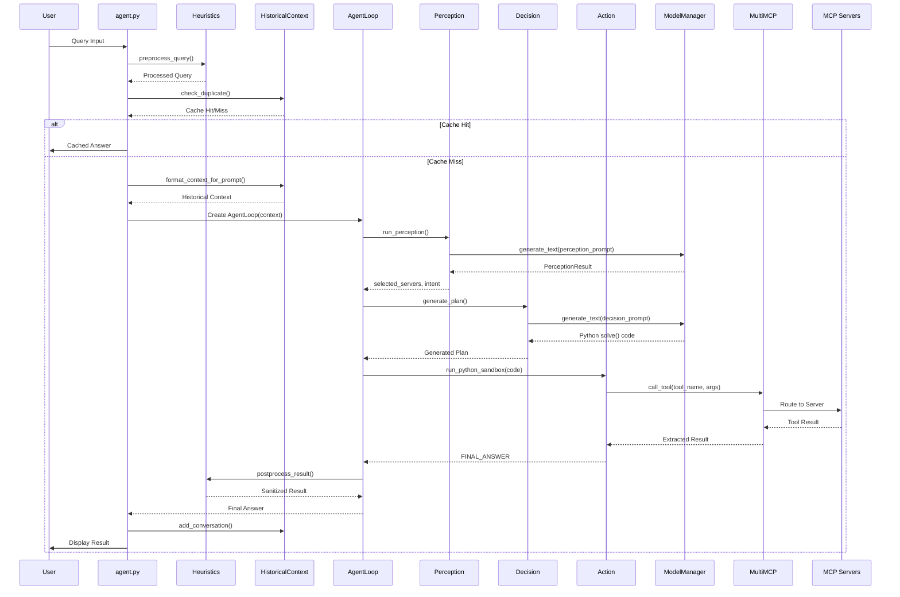
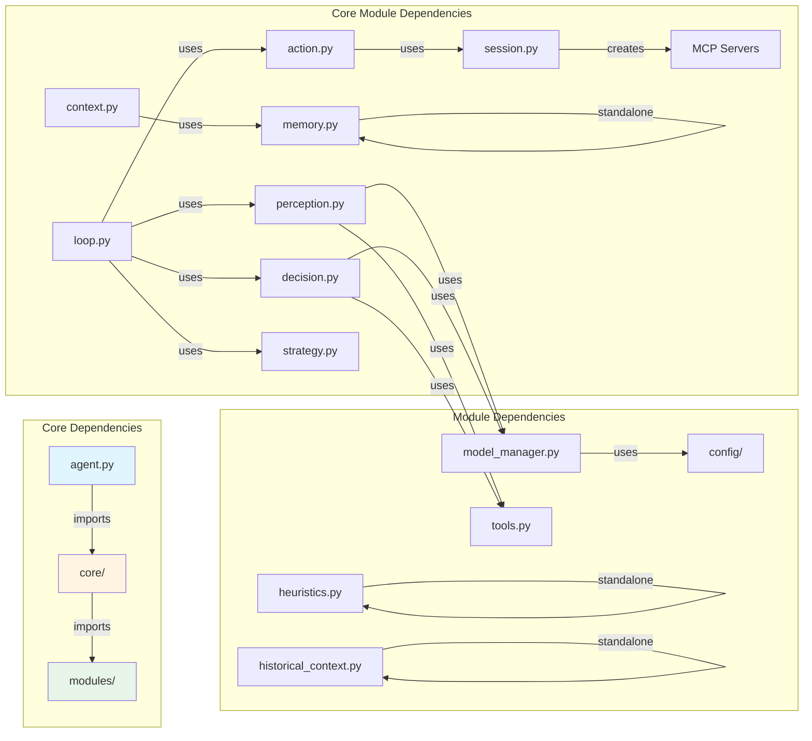
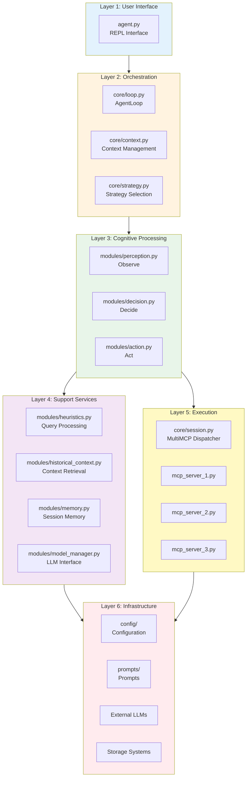

# Cortex-R Agent: Complete Architecture Diagram

## System Architecture Overview

```mermaid
graph TB
    subgraph "User Layer"
        USER[User Input/Output]
    end

    subgraph "Entry Point"
        AGENT[agent.py<br/>Main Orchestrator]
    end

    subgraph "Core Orchestration Layer"
        CONTEXT[core/context.py<br/>AgentContext<br/>AgentProfile]
        LOOP[core/loop.py<br/>AgentLoop<br/>OODA Loop]
        SESSION[core/session.py<br/>MultiMCP<br/>Tool Dispatcher]
        STRATEGY[core/strategy.py<br/>Strategy Selection]
    end

    subgraph "Cognitive Processing Layer"
        PERCEPTION[modules/perception.py<br/>Intent Extraction<br/>Server Selection]
        DECISION[modules/decision.py<br/>Planning<br/>Code Generation]
        ACTION[modules/action.py<br/>Execution<br/>Sandbox]
    end

    subgraph "Support Modules"
        HEURISTICS[modules/heuristics.py<br/>Query Preprocessing<br/>Result Postprocessing]
        HISTORICAL[modules/historical_context.py<br/>Historical Context Manager]
        MEMORY[modules/memory.py<br/>MemoryManager<br/>Session Memory]
        MODEL[modules/model_manager.py<br/>ModelManager<br/>LLM Interface]
        TOOLS[modules/tools.py<br/>Utility Functions]
    end

    subgraph "MCP Servers Layer"
        MCP1[mcp_server_1.py<br/>Math Server<br/>- add, subtract, multiply<br/>- power, factorial, sin<br/>- run_python_sandbox]
        MCP2[mcp_server_2.py<br/>Documents Server<br/>- search_stored_documents<br/>- extract_pdf<br/>- convert_webpage_url]
        MCP3[mcp_server_3.py<br/>Web Search Server<br/>- duckduckgo_search_results<br/>- download_raw_html_from_url]
    end

    subgraph "Configuration Layer"
        PROFILE[config/profiles.yaml<br/>Agent Profile<br/>Strategy Config]
        MODELS[config/models.json<br/>LLM Models Config]
        PROMPTS[prompts/<br/>Decision Prompts<br/>Perception Prompts]
    end

    subgraph "External Services"
        LLM_GEMINI[Google Gemini API]
        LLM_OLLAMA[Ollama Local LLM]
        FAISS[FAISS Index<br/>Vector Search]
        STORAGE[Memory Storage<br/>Historical Store]
    end

    %% User Flow
    USER -->|Query| AGENT
    AGENT -->|Display Result| USER

    %% Entry to Core
    AGENT -->|Initialize| CONTEXT
    AGENT -->|Create| LOOP
    AGENT -->|Initialize| SESSION
    AGENT -->|Load| PROFILE
    AGENT -->|Load| MODELS
    AGENT -->|Initialize| HEURISTICS
    AGENT -->|Initialize| HISTORICAL

    %% Core Orchestration
    LOOP -->|Get Context| CONTEXT
    LOOP -->|Select Strategy| STRATEGY
    LOOP -->|Execute Step| PERCEPTION
    LOOP -->|Execute Step| DECISION
    LOOP -->|Execute Step| ACTION
    LOOP -->|Save Memory| MEMORY

    %% Cognitive Processing
    PERCEPTION -->|Use LLM| MODEL
    PERCEPTION -->|Load Prompt| PROMPTS
    DECISION -->|Use LLM| MODEL
    DECISION -->|Load Prompt| PROMPTS
    DECISION -->|Get Context| HISTORICAL
    ACTION -->|Dispatch Tools| SESSION

    %% Support Modules
    HEURISTICS -->|Preprocess| PERCEPTION
    HEURISTICS -->|Postprocess| ACTION
    HISTORICAL -->|Store/Retrieve| STORAGE
    MEMORY -->|Store/Retrieve| STORAGE
    MODEL -->|Call| LLM_GEMINI
    MODEL -->|Call| LLM_OLLAMA

    %% MCP Layer
    SESSION -->|Route| MCP1
    SESSION -->|Route| MCP2
    SESSION -->|Route| MCP3
    MCP2 -->|Search| FAISS
    MCP2 -->|Embed| LLM_OLLAMA

    %% Configuration
    CONTEXT -->|Load| PROFILE
    MODEL -->|Load| MODELS
    STRATEGY -->|Load| PROMPTS

    style AGENT fill:#e1f5ff
    style LOOP fill:#fff4e1
    style PERCEPTION fill:#e8f5e9
    style DECISION fill:#e8f5e9
    style ACTION fill:#e8f5e9
    style SESSION fill:#f3e5f5
    style MCP1 fill:#fff9c4
    style MCP2 fill:#fff9c4
    style MCP3 fill:#fff9c4
    style MODEL fill:#ffebee
```



## Detailed Component Flow



## Module Dependencies



## Data Flow Architecture

```mermaid
flowchart TD
    START[User Query] --> PREPROCESS[Heuristics: Preprocess]
    PREPROCESS --> CACHE{Historical Context<br/>Cache Check}
    CACHE -->|Hit| CACHED[Cached Answer]
    CACHE -->|Miss| PERCEPTION[Perception Module]
    
    PERCEPTION --> LLM1[ModelManager: LLM Call]
    LLM1 --> PERCEPTION_RESULT[PerceptionResult:<br/>- intent<br/>- entities<br/>- selected_servers]
    
    PERCEPTION_RESULT --> STRATEGY[Strategy: Select Prompt]
    STRATEGY --> DECISION[Decision Module]
    
    DECISION --> LLM2[ModelManager: LLM Call]
    LLM2 --> PLAN[Generated solve() Code]
    
    PLAN --> ACTION[Action Module: Sandbox]
    ACTION --> MCP_DISPATCH[MultiMCP: Dispatch]
    
    MCP_DISPATCH --> MCP1_TOOL[MCP Server 1: Math Tools]
    MCP_DISPATCH --> MCP2_TOOL[MCP Server 2: Document Tools]
    MCP_DISPATCH --> MCP3_TOOL[MCP Server 3: Web Tools]
    
    MCP1_TOOL --> RESULT[Tool Results]
    MCP2_TOOL --> RESULT
    MCP3_TOOL --> RESULT
    
    RESULT --> POSTPROCESS[Heuristics: Postprocess]
    POSTPROCESS --> FINAL{Contains<br/>FINAL_ANSWER?}
    
    FINAL -->|Yes| STORE[Historical Context: Store]
    FINAL -->|No| FURTHER[FURTHER_PROCESSING_REQUIRED]
    FURTHER --> PERCEPTION
    
    STORE --> OUTPUT[Display to User]
    CACHED --> OUTPUT
    
    style START fill:#e1f5ff
    style OUTPUT fill:#c8e6c9
    style LLM1 fill:#ffebee
    style LLM2 fill:#ffebee
    style MCP_DISPATCH fill:#fff9c4
```

## Layered Architecture



## Component Responsibilities

### Entry Point
- **agent.py**: Main entry point, REPL loop, session management, heuristics integration

### Core Orchestration
- **core/context.py**: AgentContext (state container), AgentProfile (configuration)
- **core/loop.py**: AgentLoop (OODA loop orchestration)
- **core/session.py**: MultiMCP (tool dispatcher, MCP server management)
- **core/strategy.py**: Strategy selection (conservative/exploratory planning)

### Cognitive Processing
- **modules/perception.py**: Intent extraction, entity recognition, MCP server selection
- **modules/decision.py**: Planning, code generation (solve() function)
- **modules/action.py**: Execution, Python sandbox, tool result extraction

### Support Modules
- **modules/heuristics.py**: Query preprocessing, result postprocessing, validation
- **modules/historical_context.py**: Historical conversation storage/retrieval by topic
- **modules/memory.py**: Session memory management (MemoryManager, MemoryItem)
- **modules/model_manager.py**: Unified LLM interface (Gemini/Ollama)
- **modules/tools.py**: Utility functions (prompt loading, JSON extraction)

### MCP Servers
- **mcp_server_1.py**: Math operations, Python sandbox, shell commands
- **mcp_server_2.py**: Document search (FAISS), PDF extraction, webpage conversion
- **mcp_server_3.py**: Web search (DuckDuckGo), HTML download

### Configuration
- **config/profiles.yaml**: Agent profile, strategy, memory, LLM configuration
- **config/models.json**: LLM model definitions (Gemini, Ollama)
- **prompts/**: Decision prompts, perception prompts

